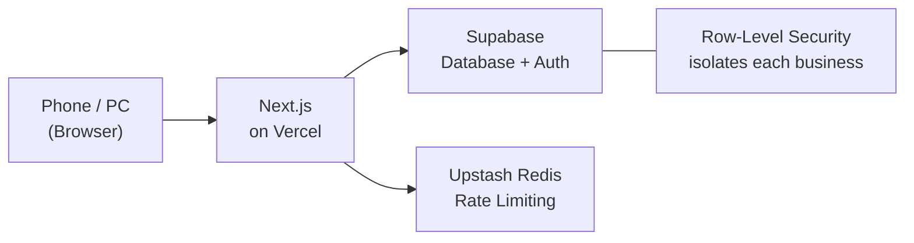

# ParkLedger

A multi-tenant SaaS platform that digitizes parking lot operations for small operators in Japan.

It replaced a paper-ledger workflow entirely — and **is actively used today by a real parking lot operator for daily work.**

**Tech Stack:** Next.js · TypeScript · Supabase · Vercel · Upstash Redis

🇯🇵 日本語版 → [README_JA.md](README_JA.md)

---

## 🚀 Try It in 3 Minutes

**[parkledger.vercel.app](https://parkledger.vercel.app)**

| Login ID | Password |
|----------|----------|
| `demo` | `demo2026` |

Works great on mobile. All demo data is fictional — **feel free to click around and change things** (the demo resets automatically every night).

---

## Why I Built This

An acquaintance who runs a small monthly parking lot relied on paper ledgers and manual work for payment tracking, overdue follow-ups, and contract management. **ParkLedger turned hours of monthly paperwork into a few minutes on a smartphone.**

The user is in their 60s with no IT background, so the design priority was not "more features" but "never getting lost on site":

- Large text and high contrast
- Today's action items (unpaid tenants, expiring contracts) shown the moment the app opens
- A one-tap call button next to every unpaid tenant

---

## Screenshots

### Dashboard — monthly payment status at a glance

### Payment Tracking — mark payments, download monthly reports

### Tenant Management — contracts and vehicle info

### Parking Slots — vacancy status across all spaces

### Mobile View — optimized for on-site use

---

## What It Does

| Feature | Details |
|---|---|
| **Dashboard** | Real-time monthly payment status, vacancy rate, expiring contracts |
| **Payment Tracking** | Mark payments, export monthly reports as CSV |
| **Tenant Management** | Contract dates, vehicle info, archiving |
| **Parking Slots** | Bulk registration, vacancy / occupied status |
| **Cleaning Records** | Log cleaning history with photo uploads |
| **Inquiries** | Manage tenant inquiries with status tracking |
| **Receipts & Documents** | Print-ready parking permit and receipt PDFs |
| **Multi-tenant** | Each business sees only their own data |

---

## How I Work — Using AI as My Engineer

The implementation code in this project is written by AI (Claude). My work is everything before and after that:

- **Finding and defining the problem** — interviewing the actual operator and prioritizing features by "what is most painful"
- **Owning the spec and UX decisions** — every instruction to the AI is grounded in "can a 60-year-old first-time user navigate this?"
- **Running the feedback loop** — shipping, watching real usage, and folding feedback into the next iteration
- **Taking responsibility for quality** — having the AI audit its own code for security issues, then verifying and shipping the fixes (the history is visible in the commit log)

The core experience wasn't "having AI build an app" — it was **planning, improving, and operating a service that a real user depends on.**

---

## Security

The app handles real personal data (tenant names, phone numbers, vehicle info), so it implements:

- Row-Level Security for complete tenant isolation at the database level
- Rate limiting against brute-force login attempts
- bcrypt password hashing
- CSV injection protection on exports
- Upload validation and signed URLs for photos

---

## Architecture

Built entirely on managed services — **near-zero running cost and minimal maintenance**, sustainable for a solo developer operating in production.

---

## Roadmap

- Automated payment reminders
- Annual income reports
- Multi-location support

---

## Project Timeline

May 2026 – Present — Individual project (AI-assisted development)
