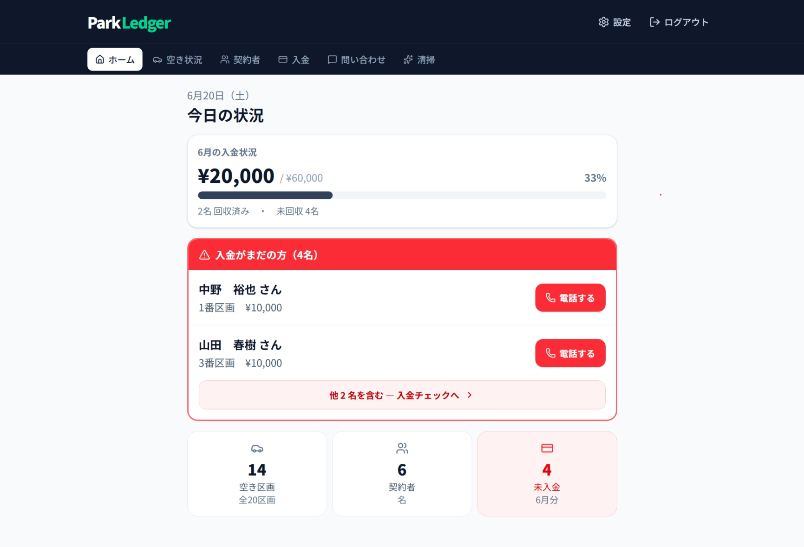
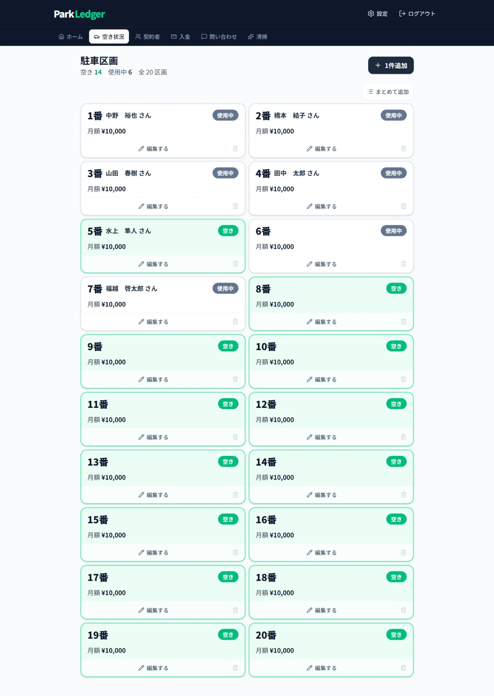

# ParkLedger

A multi-tenant SaaS platform that digitizes parking lot operations for small operators in Japan.

Built independently with AI-assisted development to replace paper-based workflows with a modern web application.

**Tech Stack:** Next.js · TypeScript · Supabase · Vercel · Upstash Redis

🇯🇵 日本語版 → [README_JA.md](README_JA.md)

---

## Live Demo

> [parkledger.vercel.app](https://parkledger.vercel.app)

*(Login required — screenshots below)*

---

## Why I Built This

Parking lot operators in Japan typically manage everything with paper ledgers or spreadsheets. An acquaintance who runs a small parking lot was doing exactly that — tracking monthly payments by hand, calling tenants one by one to chase overdue fees, and keeping contracts in a binder.

ParkLedger replaces that entire workflow. The target users are operators in their 60s with limited tech experience, so the UI is designed with large text, high contrast, and minimal complexity — optimized for mobile use in the field.

---

## Screenshots

### Dashboard — monthly payment status at a glance


### Payment Tracking — mark payments, download monthly reports


### Tenant Management — contracts and vehicle info


### Parking Slots — vacancy status across all spaces


---

## What It Does

| Feature | Details |
|---|---|
| **Dashboard** | Real-time monthly payment status, vacancy rate, expiring contracts |
| **Payment Tracking** | Mark payments, export monthly reports as CSV |
| **Tenant Management** | Contract dates, vehicle info, archiving |
| **Parking Slots** | Bulk registration, vacancy / occupied status |
| **Cleaning Records** | Log cleaning history with photo uploads |
| **Inquiries** | Manage tenant inquiries with status tracking |
| **Receipts & Documents** | Print-ready parking permit and receipt PDFs |
| **Multi-tenant** | Each business sees only their own data |
| **PWA** | Installable on mobile |

---

## Tech Stack

| Layer | Technology |
|---|---|
| **Frontend** | Next.js / TypeScript / Tailwind CSS |
| **Backend** | Serverless API routes (Next.js) |
| **Database** | Supabase (PostgreSQL) |
| **Auth** | Supabase Auth |
| **Infrastructure** | Vercel / Upstash Redis |

---

## Security

- Row-Level Security — data isolation between tenants at the database level
- Rate limiting on all auth endpoints
- bcrypt password hashing
- CSV injection protection on all exports
- Image upload validation

---

## Development Process

This project was developed with AI-assisted coding tools.

I focused on problem definition, feature design, user experience, and iterative improvement — while leveraging AI to accelerate implementation.

Through this project, I learned how modern full-stack applications are structured, deployed, and secured at a production level.

---

<details>
<summary>Architecture details</summary>

```
Browser
   │
   ▼
Next.js (Vercel) ── Server-side rendering + API Routes
   │
   ▼
Supabase (PostgreSQL)
   │
   ├── Row-Level Security ── Each org sees only its own data
   └── Auth ── Session management + custom login ID resolution
   │
   ▼
Upstash Redis ── Persistent rate limiting across serverless instances
```

**Multi-tenant isolation via RLS**
Every database query is automatically scoped to the logged-in user's organization. Supabase Row-Level Security policies enforce this at the database level.

**Custom login ID system**
Users log in with a short alphanumeric ID instead of their email address, improving UX for non-technical operators.

**Persistent rate limiting**
Auth endpoints are rate-limited using Upstash Redis, which maintains state across serverless function instances.

**Server-first rendering**
All data fetching happens on the server. The client receives rendered HTML with no loading spinners on the main views.

</details>

---

## Project Structure

```
src/
├── app/
│   ├── api/          # API routes (auth, payments, contractors, …)
│   ├── payments/     # Payment tracking UI
│   ├── contractors/  # Tenant management UI
│   ├── garages/      # Parking slot management UI
│   ├── cleaning/     # Cleaning log UI
│   ├── inquiries/    # Inquiry management UI
│   └── print/        # Receipt & permit print views
├── lib/
│   ├── supabase/     # Server / client / admin Supabase clients
│   ├── rate-limit.ts # Rate limiter
│   └── validate-image.ts
└── components/       # Shared UI components
```

---

## Local Development

```bash
# 1. Clone the repo
git clone https://github.com/yuki-dev-app/parkledger.git
cd parkledger

# 2. Install dependencies
npm install

# 3. Set up environment variables
cp .env.local.example .env.local
# Fill in your Supabase and Upstash credentials

# 4. Run the dev server
npm run dev
```

Open [http://localhost:3000](http://localhost:3000).

**Required environment variables:**

```
NEXT_PUBLIC_SUPABASE_URL=
NEXT_PUBLIC_SUPABASE_ANON_KEY=
SUPABASE_SERVICE_ROLE_KEY=
UPSTASH_REDIS_REST_URL=
UPSTASH_REDIS_REST_TOKEN=
```
