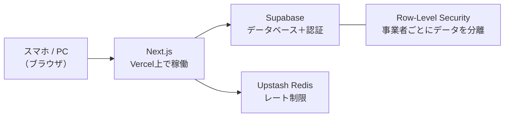

# ParkLedger

小規模駐車場オーナー向けの、業務をまるごとデジタル化するSaaSアプリケーションです。

紙台帳・スプレッドシートによる管理をWebアプリに置き換え、**現在も実際の駐車場運営者が日常業務で利用しています。**

**技術スタック：** Next.js · TypeScript · Supabase · Vercel · Upstash Redis

🇺🇸 English version → [README.md](README.md)

---

## 🚀 3分で触れるデモ

**[parkledger.vercel.app](https://parkledger.vercel.app)**

| ログインID | パスワード |
|-----------|-----------|
| `demo` | `demo2026` |

スマホからそのまま開けます。データはすべて架空のサンプルで、**自由に操作してOK**です（毎日深夜に自動で初期状態にリセットされます）。

---

## なぜ作ったか

知人が運営する月極駐車場では、入金確認・未払い対応・契約管理の多くが紙台帳と手作業に依存していました。**月に数時間かかっていたその作業を、スマホで数分で終わる形に置き換えたのが ParkLedger です。**

利用者は60代・IT未経験の方。だからこそ「多機能」ではなく、

- 文字を大きく、コントラストを強く
- 今日やるべきこと（未入金の人・期限が近い契約）を開いた瞬間に表示
- 未入金者にはワンタップで電話できるボタンを配置

という「現場で迷わないこと」を最優先に設計しました。

---

## スクリーンショット

### ダッシュボード — 今月の入金状況を一目で把握

### 入金チェック — 入金登録・月次レポートのダウンロード

### 契約者管理 — 契約情報・車両情報の一元管理

### 駐車区画 — 空き・使用中の状況をひと目で確認

### モバイル表示 — 現場での利用を想定したUI

---

## 主な機能

| 機能 | 詳細 |
|------|------|
| **ダッシュボード** | 月次入金状況・空き率・契約満了予定をリアルタイム表示 |
| **入金管理** | 入金登録、月次レポートのCSVエクスポート |
| **契約者管理** | 契約期間・車両情報・アーカイブ管理 |
| **駐車区画** | 一括登録、空き／使用中のステータス管理 |
| **清掃記録** | 写真付きで清掃履歴を記録 |
| **問い合わせ** | テナントからの問い合わせをステータス管理 |
| **帳票印刷** | 駐車許可証・領収書のPDF印刷 |
| **マルチテナント** | 各事業者のデータを完全分離 |

---

## 開発の進め方 — AIをエンジニアとして使う

このプロジェクトの実装コードはAI（Claude）が書いています。私が担ったのは、その手前と後ろにある仕事です。

- **課題の発見と定義** — 実際の運営者にヒアリングし、「何がいちばん面倒か」から機能を決める
- **仕様とUXの意思決定** — 60代の利用者が迷わない画面とは何か、を基準にAIへの指示を組み立てる
- **検証と改善のサイクル** — 実際に使ってもらい、フィードバックを次の開発に反映する
- **品質への責任** — セキュリティの点検をAIに依頼して問題を洗い出させ、修正を検証・リリースする運用を繰り返す（修正履歴はコミットログに残しています）

「AIに作らせて終わり」ではなく、**実在するユーザーの業務を支えるサービスとして企画・改善・運用まで回した**ことが、このプロジェクトで得た一番の経験です。

---

## セキュリティ

実際の個人情報（契約者の氏名・電話番号・車両情報）を預かるため、次の対策を実装しています。

- テナント間のデータをデータベースレベルで完全分離（Row-Level Security）
- ログインへの連続攻撃を防ぐレート制限
- パスワードのハッシュ化保存
- CSVエクスポートへのインジェクション対策
- 画像アップロードの検証・写真URLの署名付き化

---

## アーキテクチャ

サーバー管理が不要なサービスのみで構成し、個人開発でも**運用コストほぼゼロ・メンテナンス最小**で本番運用を続けられる形にしています。

---

## 今後の予定

- 入金リマインダーの自動通知
- 収支の年間レポート
- 複数駐車場（複数拠点）対応

---

## 開発期間

2026年5月〜現在（個人開発 / AI-assisted development）
