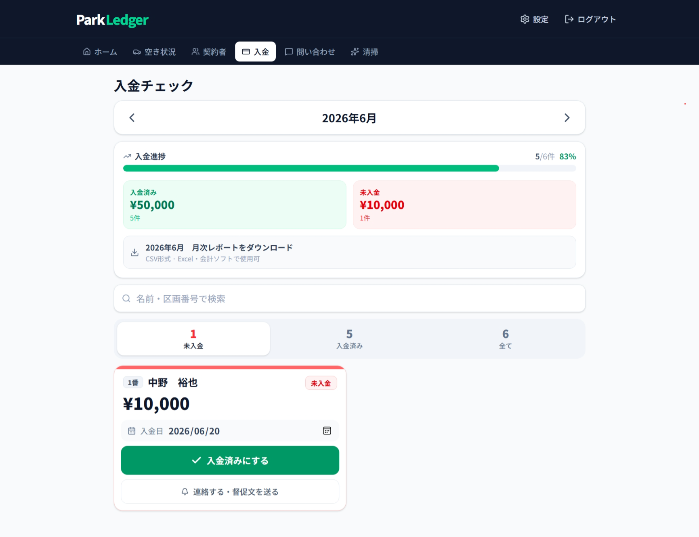
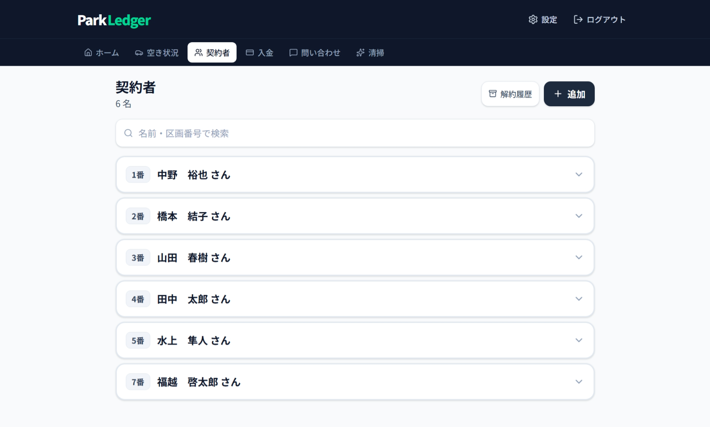
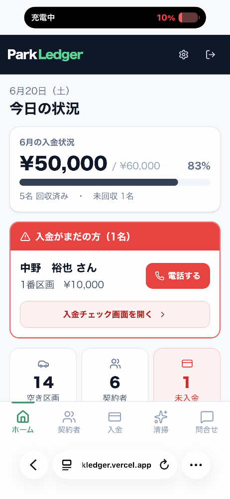

# ParkLedger

小規模駐車場オーナー向けの、業務をまるごとデジタル化するSaaSアプリケーションです。

紙台帳・スプレッドシートによる管理を、AIコーディングツールも活用しながら開発したWebアプリに置き換えました。

**技術スタック：** Next.js · TypeScript · Supabase · Vercel · Upstash Redis

🇺🇸 English version → [README.md](README.md)

---

## 開発期間

2026年6月（個人開発 / AI-assisted development）

---

## ライブデモ

> [parkledger.vercel.app](https://parkledger.vercel.app)

※ログインが必要です（スクリーンショットは下記）

---

## なぜ作ったか

知人の駐車場管理では、入金確認や未払い対応、契約管理の多くが紙台帳と手作業に依存していました。

ParkLedger はその業務をまるごと置き換えます。ターゲットユーザーは60代のIT未経験者。文字を大きく・コントラストを強く・操作を極力シンプルに設計し、スマートフォンでの現場利用を想定しています。

---

## スクリーンショット

### ダッシュボード — 今月の入金状況を一目で把握


### 入金チェック — 入金登録・月次レポートのダウンロード


### 契約者管理 — 契約情報・車両情報の一元管理


### 駐車区画 — 空き・使用中の状況をひと目で確認


### モバイル表示 — 現場での利用を想定したUI


---

## 主な機能

| 機能 | 詳細 |
|------|------|
| **ダッシュボード** | 月次入金状況・空き率・契約満了予定をリアルタイム表示 |
| **入金管理** | 入金登録、月次レポートのCSVエクスポート |
| **契約者管理** | 契約期間・車両情報・アーカイブ管理 |
| **駐車区画** | 一括登録、空き／使用中のステータス管理 |
| **清掃記録** | 写真付きで清掃履歴を記録 |
| **問い合わせ** | テナントからの問い合わせをステータス管理 |
| **帳票印刷** | 駐車許可証・領収書のPDF印刷 |
| **マルチテナント** | 各事業者のデータを完全分離 |
| **PWA対応** | スマートフォンにインストール可能 |

---

## 技術スタック

| レイヤー | 技術 |
|----------|------|
| **フロントエンド** | Next.js / TypeScript / Tailwind CSS |
| **バックエンド** | サーバーレスAPIルート（Next.js） |
| **データベース** | Supabase（PostgreSQL） |
| **認証** | Supabase Auth |
| **インフラ** | Vercel / Upstash Redis |

---

## セキュリティ

- Row-Level Security — データベースレベルでテナント間のデータを完全分離
- 認証エンドポイントへのレート制限（ブルートフォース対策）
- bcryptによるパスワードハッシュ化
- CSVエクスポートへのインジェクション対策
- 画像アップロードの検証

---

## 開発プロセス

本プロジェクトはAIコーディングツールを活用して開発しました。

問題定義・機能設計・UX設計・改善サイクルを自分で担い、実装の加速にAIを活用するスタイルで進めました。

このプロジェクトを通じて、フルスタックWebアプリケーションの設計、データベース構築、デプロイ、本番運用までの一連の流れを実践的に学びました。

---

<details>
<summary>アーキテクチャ詳細（興味のある方向け）</summary>

```
ブラウザ
   │
   ▼
Next.js（Vercel）── サーバーサイドレンダリング + APIルート
   │
   ▼
Supabase（PostgreSQL）
   │
   ├── Row-Level Security ── テナントごとにデータを自動スコープ
   └── Auth ── セッション管理 + カスタムログインID解決
   │
   ▼
Upstash Redis ── サーバーレス環境を跨いだ永続的なレート制限
```

</details>
